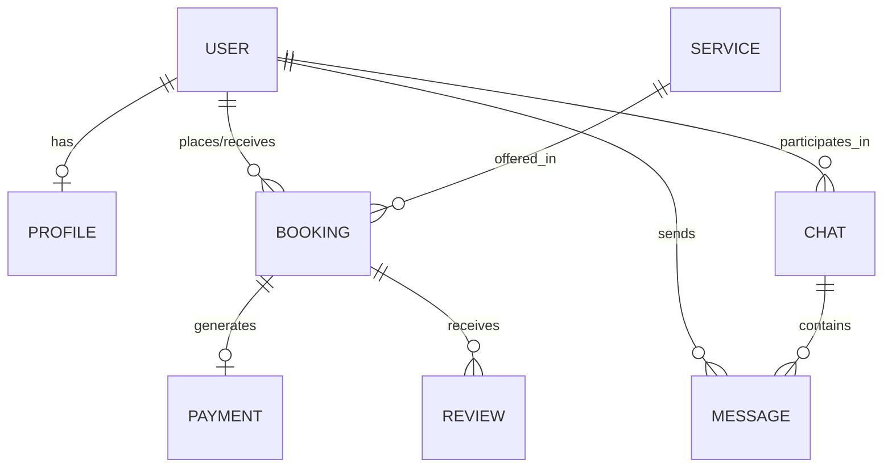

# Entity Relationship Diagram (ERD) & Database Schema

This document outlines the data structure for the Local Service Marketplace, designed for a relational database (PostgreSQL) with support for offline-local synchronization (WatermelonDB).

## 1. High-Level ERD

## 2. Table Definitions

### 2.1 Users (`users`)
Stores core identity and authentication state.

| Field | Type | Description |
| :--- | :--- | :--- |
| `id` | UUID (PK) | Unique Identifier. |
| `phone` | String (Unique) | Primary login (India-focused). |
| `full_name` | String | User's display name. |
| `role` | Enum | `CLIENT`, `PROVIDER`, `ADMIN`. |
| `language_pref` | String | Defaults to `hi` (Hindi). |
| `created_at` | Timestamp | Account creation date. |

### 2.2 Profiles (`profiles`)
Extended information for service providers.

| Field | Type | Description |
| :--- | :--- | :--- |
| `id` | UUID (PK) | PK. |
| `user_id` | UUID (FK) | Link to `users.id`. |
| `bio` | Text (JSON) | Support for multi-language bios. |
| `rating` | Float | Average rating (0.0 to 5.0). |
| `is_verified` | Boolean | True if ID proof is verified. |
| `availability` | JSONB | Scheduled hours/slots. |

### 2.3 Services (`services`)
Catalog of available work types.

| Field | Type | Description |
| :--- | :--- | :--- |
| `id` | UUID (PK) | PK. |
| `category` | String | e.g., "Plumbing", "Cleaning". |
| `name_translations` | JSONB | `{ "en": "Plumber", "hi": "प्लंबर" }`. |
| `base_price` | Decimal | Starting price for the service. |

### 2.4 Bookings (`bookings`)
Transactional engine logic.

| Field | Type | Description |
| :--- | :--- | :--- |
| `id` | UUID (PK) | PK. |
| `client_id` | UUID (FK) | Linked to `users.id`. |
| `provider_id` | UUID (FK) | Linked to `users.id`. |
| `service_id` | UUID (FK) | Linked to `services.id`. |
| `status` | Enum | `PENDING`, `ACCEPTED`, `IN_PROGRESS`, `COMPLETED`, `CANCELLED`. |
| `scheduled_at` | Timestamp | Date/Time for the service. |
| `offline_id` | String | ID generated by mobile client for offline sync. |

### 2.5 Payments (`payments`)
Razorpay transaction tracking.

| Field | Type | Description |
| :--- | :--- | :--- |
| `id` | UUID (PK) | PK. |
| `booking_id` | UUID (FK) | Linked to `bookings.id`. |
| `amount` | Decimal | Total amount paid. |
| `razorpay_order_id`| String | Reference from Razorpay. |
| `escrow_status` | Enum | `HELD`, `RELEASED`, `REFUNDED`. |

## 3. Sync & Offline Strategy
To support the **Offline-First** requirement:
*   **Version Columns**: Each table includes a `version` (integer) and `last_modified` column.
*   **Sync Logic**: When the mobile app goes online, it pushes all records with a `null` server ID or high `version` to the `SyncModule`.
*   **Conflict Handling**: Server timestamp-based logic ("Last Write Wins") for simple attributes; specific logic for `Bookings` (e.g., cannot accept a booking that was already cancelled on the server).
