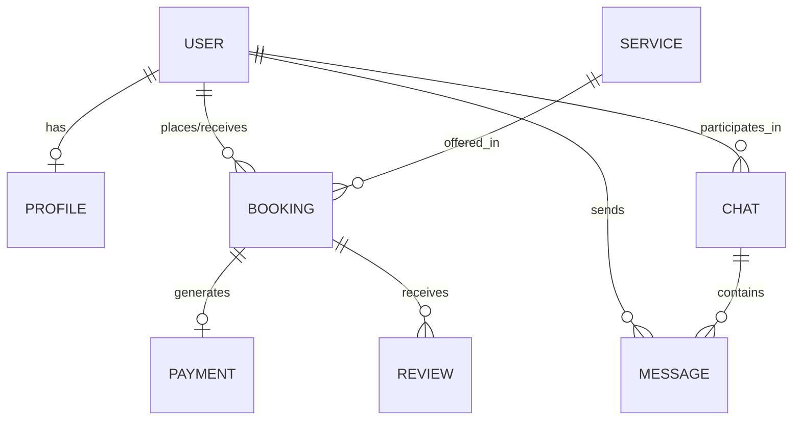
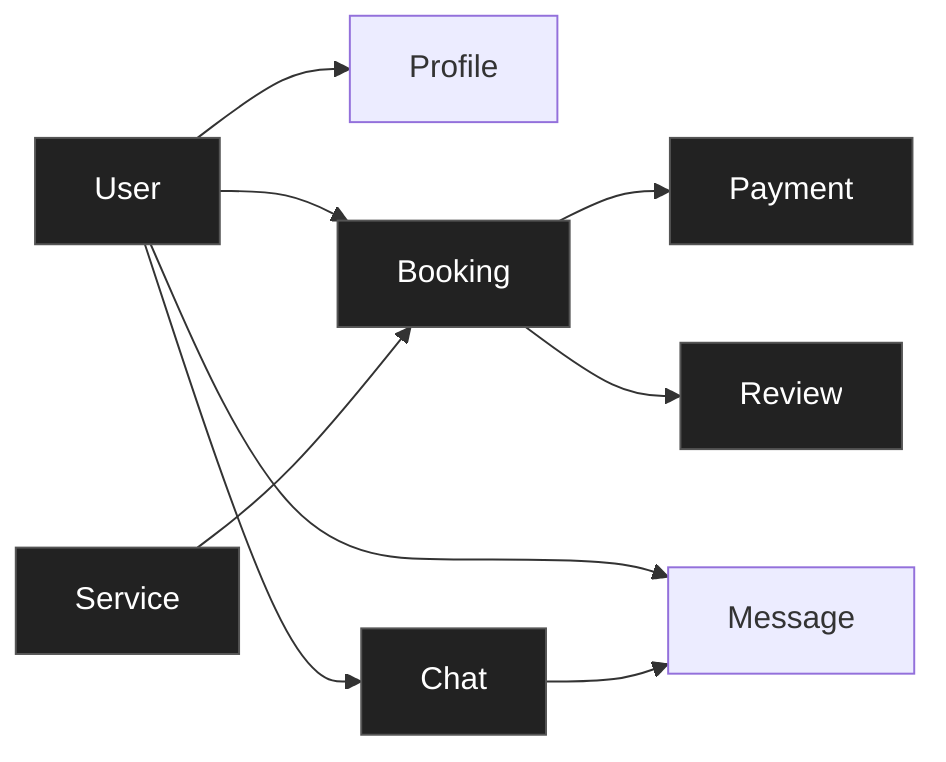
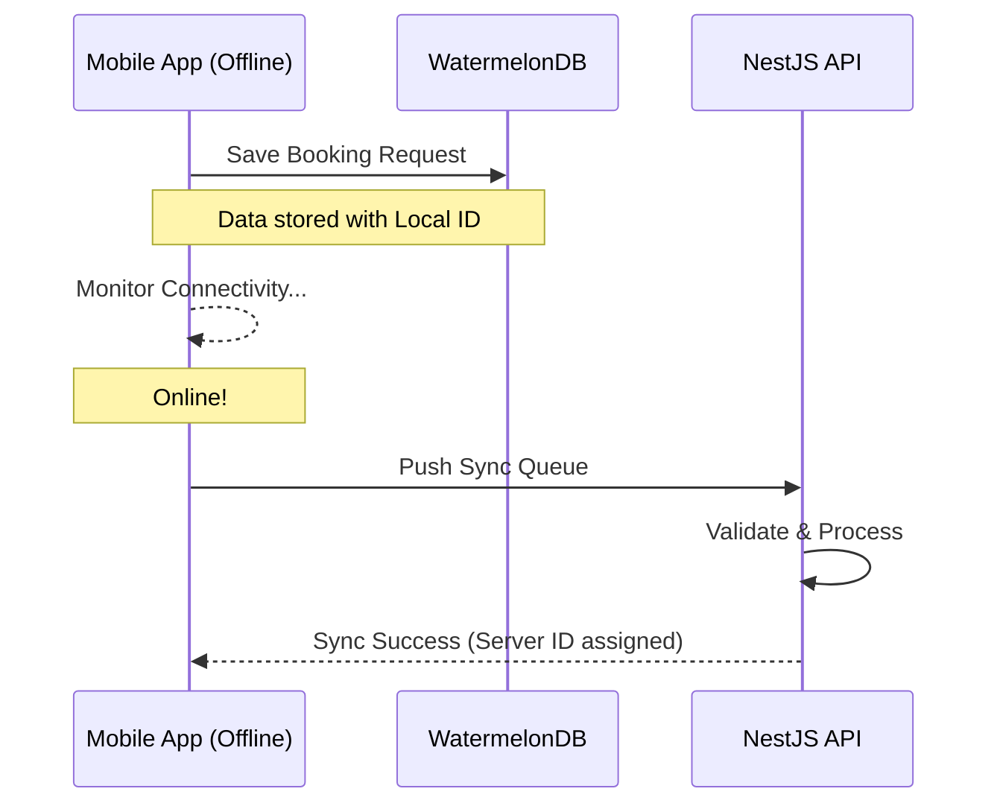

# Project Architecture Diagrams

This document contains all the visual representations of the Local Service Marketplace architecture and data flows.

## 1. High-Level System Architecture
This diagram shows the relationship between the offline-first mobile client, the modular backend, and external integrations.

```mermaid
graph TD
    subgraph "Clients (Offline-First)"
        MA["Mobile App (React Native + WatermelonDB)"]
        WD["Web Dashboard (Next.js)"]
    end

    subgraph "Backend (Modular Monolith)"
        CoreAPI["Node.js / NestJS API"]
        AuthModule["Auth & User Management"]
        SyncModule["Offline Sync Logic"]
        BookingModule["Booking & Scheduling"]
        PaymentModule["Razorpay Integration"]
    <ctrl95>

    subgraph "Data Storage"
        Postgres[("PostgreSQL")]
        Redis[("Redis Cache")]
    end

    subgraph "External Services"
        Firebase["Firebase FCM"]
        Razorpay["Razorpay Gateway"]
        S3["AWS S3"]
    end

    MA <--> CoreAPI
    WD --> CoreAPI
    CoreAPI --> Postgres
    CoreAPI --> Redis
    CoreAPI --> Razorpay
```

## 2. Entity Relationship Diagram (ERD)
This diagram details how the database tables interact with one another.



## 3. Feature Map (Entity Interaction)
*Based on the project overview diagram provided.*



## 4. Offline Sync Flow
How the app handles data when connectivity is lost.


