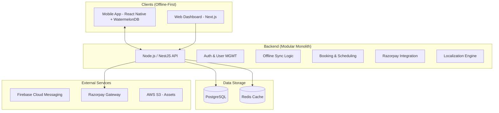

# diagrams and flows

## High-Level System Architecture

### Tech Stack Selection

| Layer | Technology | Rationale |
| :--- | :--- | :--- |
| **Mobile State** | WatermelonDB / SQLite | High-performance local storage for offline-first capabilities. |
| **Multilingual** | react-i18next | Industry standard for managing translation keys in React/RN. |
| **Payments** | Razorpay SDK | Optimal for the target market with robust UPI/Card support. |
| **Backend** | NestJS | Modular architecture that can evolve into microservices. |
| **Database** | PostgreSQL | Robust relational data for complex booking lifecycle. |

## Feature Specifications

### 1. Offline Booking & Sync
- **Local Persistence**: Users can browse cached services and create booking requests while offline.
- **Conflict Resolution**: Logic to handle cases where a slot might have been taken while the user was offline.
- **Sync Queue**: Outbound requests are queued and processed automatically when connectivity returns.

### 2. Internationalization (i18n)
- **JSON-based Translations**: Decouple text from code.
- **RTL Support**: Design layouts to support Right-to-Left languages if needed in the future.

### 3. Razorpay Integration
- **Escrow Model**: Support for holding payments until service completion.
- **Platform Fees**: Automated split between service provider and platform.

## Revised Roadmap

### Phase 1: Foundation (Sync & i18n)
- [ ] Repo scaffolding with **i18next** setup.
- [ ] Mobile local database schema (WatermelonDB).
- [ ] User Auth with Session persistence.

### Phase 2: Marketplace & Sync Logic
- [ ] Offline-supported service catalog.
- [ ] Sync Engine for booking requests.
- [ ] Slot booking logic with server-side locks.

### Phase 3: Financials
- [ ] Razorpay API integration (Webhooks for payment status).
- [ ] Provider payout wallet.

## Verification Plan

### Automated Tests
- Sync logic unit tests (simulating network failures).
- Internationalization tests (Ensuring no hardcoded strings).

### Manual Verification
- Testing Razorpay Sandbox transactions.
- "Airplane Mode" testing for offline booking flow.

### security 
JWT auth ✅ bcrypt ✅ ValidationPipe ✅ Secure CORS ✅ HTTPS

## Module Breakdown & Development Schedule

| No. | Module | Primary Responsibility |
| :--- | :--- | :--- |
| 1 | **Auth & User MGMT** | Phone OTP, JWT tokens, and Role management (Client/Provider/Admin). |
| 2 | **Profiles** | Managing verification status, location, and multilingual bios. |
| 3 | **Service Catalog** | Browsing the hierarchy of services (e.g., Plumbers, Carpenters) and pricing. |
| 4 | **Booking Engine** | The transactional lifecycle (Pending → Accepted → In-Progress → Completed). |
| 5 | **Offline Sync** | The reconciliation logic between the Mobile App (WatermelonDB) and NestJS. |
| 6 | **Payment Integration** | Razorpay flow including Escrow (holding payment until job completion). |
| 7 | **Chat & Messaging** | Real-time communication with local caching for offline viewing. |
| 8 | **Reviews & Ratings** | User feedback loop for quality assurance and provider reputation. |
| 9 | **Notifications** | Push notification alerts via Firebase (FCM) for booking updates. |
| 10 | **Localization (i18n)** | System-wide support for translation keys (Day 1: Hindi & English). |
